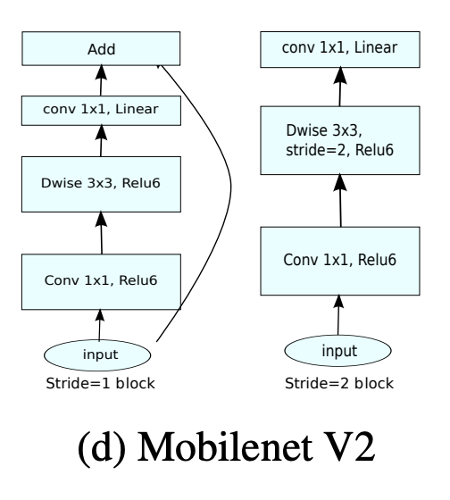

# Image-Recognation-Multilabel-case-with-Transfer-learning-CNN-MobileNet-V2-

About
------
IMAGE RECOGNATION
Image recognition, in the context of machine vision, is the ability of software to identify 
objects, places, people, writing and actions in images. Computers can use machine 
vision technologies in combination with a camera and artificial intelligence software to 
achieve image recognition. Image recognition is used to perform a large number of
machine-based visual tasks, such as labeling the content of images with meta-tags, 
performing image content search and guiding autonomous robots, self-driving cars and 
accident avoidance systems.

Goal
-----
Predict what labels will be from an image.

Model
------

In this case, we will use a Transfer Learning Convolution Neural Network from 'MobileNet V2'.
We're just changing the full connected to fit our case from MultiClass to Multilabel.

Predictive Result
------------------

Thank You
Email: ramzym872@gmail.com
